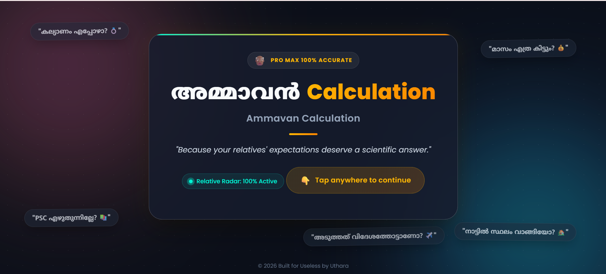
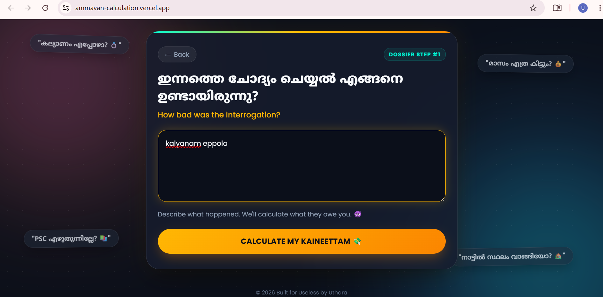
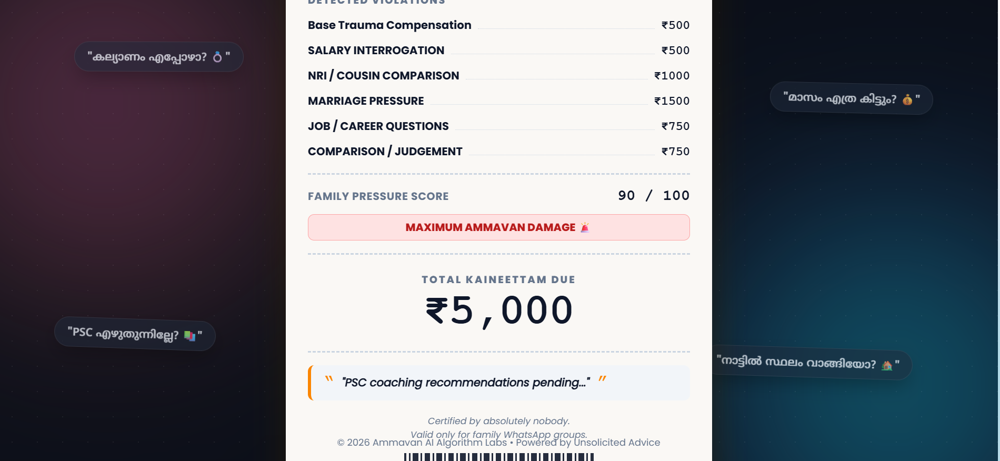
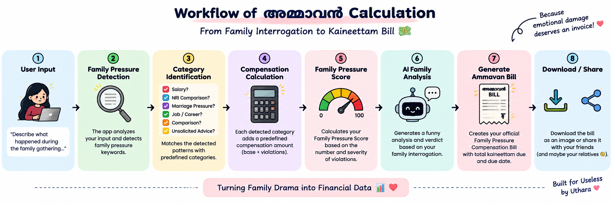

# അമ്മാവൻ Calculation 🎯

## Basic Details
### Team Name: Uthara Uthaman

### Team Members
- Team Lead: Uthara Uthaman - CAPE College of Engineering, Alappuzha

### Project Description
**അമ്മാവൻ Calculation** is a completely unnecessary financial calculator that calculates how much "കൈനീട്ടം" your relatives supposedly owe you for the emotional damage caused by family interrogations.

It detects salary questions, Dubai/NRI comparisons, marriage pressure, career questions, comparisons and unsolicited advice, then generates a hilarious **Family Pressure Compensation Bill**. 😂💸

---

## The Problem (that doesn't exist)
Every Malayali family gathering comes with unavoidable questions:

- "Salary ethra?"
- "Kalyanam eppo?"
- "Dubai-il ulla cousin ethra earn cheyyunnu?"
- "Joli enthaayi?"
- "Avane kandille?"

Unfortunately, there is no scientific system to calculate the emotional compensation owed for surviving these questions.

**This is obviously a serious problem.**

---

## The Solution (that nobody asked for)
I created **അമ്മാവൻ Calculation**.

The app analyzes your family interrogation, detects different types of family pressure, assigns completely arbitrary compensation amounts, calculates a **Family Pressure Score**, and generates an official-looking **Ammavan Bill**.

The bill even has a due date.

Because emotional damage deserves an invoice. 💀💸

---

## Features

- 😂 Malayalam + English family-pressure calculator
- 💸 Automatic compensation calculation
- 🧠 Family-pressure detection
- 📊 Family Pressure Score
- 🔥 Visual Family Pressure Meter
- 🤖 AI-style Family Analysis
- 🎭 Funny family verdicts
- 🧾 Generateable Ammavan Bill
- 💰 Total Kaineettam Due
- 📅 Due Date
- 🖨️ Funny printer/paper-tearing sound
- 📥 Download bill as an image
- 📤 Share bill
- 📱 Responsive design
- 🌐 Fully client-side
- 🚫 No backend required

---

# How It Works

```text
User Input
     ↓
Family Pressure Detection
     ↓
Category Identification
     ↓
Compensation Calculation
     ↓
Family Pressure Score
     ↓
AI Family Analysis
     ↓
Generate Ammavan Bill
     ↓
Download / Share
```

---

## Technical Details

### Technologies/Components Used

For Software:
- **Languages:** HTML, CSS, JavaScript
- **Frameworks:** None
- **Libraries:** html2canvas
- **Fonts:** Poppins, Noto Sans Malayalam
- **Browser APIs:** Web Audio API, Web Share API
- **Tools:** Anti-Gravity, VS Code, Git, GitHub
- **Deployment:** GitHub Pages
- **Architecture:** Fully client-side

For Hardware:
- Main components: None (Fully software-based application)
- Specifications: N/A
- Tools required: N/A

---

### Implementation

For Software:

# Installation
```bash
git clone https://github.com/Uthara-art/ammavan-calculation.git
cd ammavan-calculation
```

# Run
```bash
python -m http.server 8080
```

---

### Project Documentation

For Software:

# Screenshots (Add at least 3)

*Landing page showing the Ammavan Calculation interface and relative quote badges*


*Input interrogation screen where users enter traumatic family questions*


*Itemized thermal paper receipt card with Family Pressure Meter, Total Due, and Due Date*

# Diagrams

*Workflow diagram showing user input processing, keyword detection, scoring calculation, and bill generation*


### Project Demo

# Video
[https://youtu.be/rBzWsQAMCzk]
*Demonstrates landing page interaction, interrogation input, printing sound synthesis, and receipt generation*

# Additional Demos
[https://share.google/OcZGEDN7lWXwA8bIe]

---

## Team Contributions
- Uthara Uthaman: UI/UX design, scoring engine logic, Web Audio synthesizer, receipt layout & image export/sharing features.

---
Made with ❤️ at TinkerHub Useless Projects 


